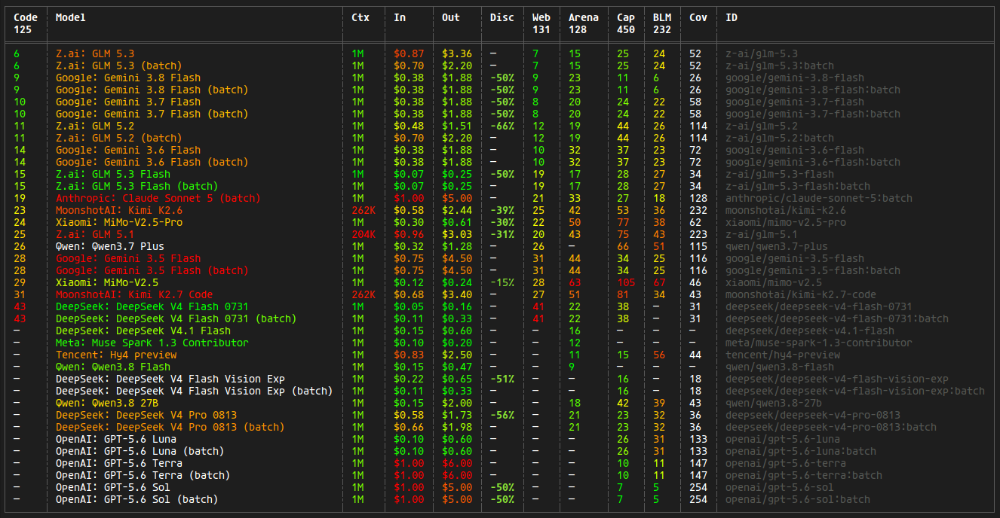

# llm-leaders

A CLI that lists coding LLMs with their **OpenRouter prices** and **arena.ai WebDev Elo** score, side by side.

Example — `llm-leaders --all --max-input 1.1 --max-any-rank 30` (cheapest-input price ≤ $1.1/M, arena rank ≤ 30, across the full OpenRouter catalog):



## Columns

| Code | Model | Ctx | In | Out | Disc | Web | Arena | Cap | BLM | Cov | ID |
| ---: | --- | ---: | ---: | ---: | ---: | ---: | ---: | ---: | ---: | ---: | --- |
| OpenRouter coding benchmark rank (`#1` best) | OpenRouter model name | context window in tokens (K/M-suffixed) | input price per million tokens | output price per million tokens | provider discount | OpenRouter website-building benchmark rank (`#1` best) | arena.ai WebDev rank (`#1` best) | BenchmarkList capability rank (`#1` best) | BenchLM overall rank (`#1` best) | number of eligible benchmarks behind the capability score | OpenRouter model ID (copy-paste to use the model) |

Prices come live from the [OpenRouter model catalog](https://openrouter.ai/api/v1/models), then refined per model with the cheapest provider from the [endpoints API](https://openrouter.ai/api/v1/models) — the same "lowest across providers" price the OpenRouter website shows. Cheapest prices are cached for 1h at `~/.config/llm-leaders/best_prices.json`; the first `--all` run takes ~20s to fetch all providers, subsequent runs are instant.
Ranks come from the [arena.ai WebDev leaderboard](https://arena.ai/leaderboard/code/webdev), scraped from the page's embedded payload and cached for 5h at `~/.config/llm-leaders/arena.json`. The Arena header shows the leaderboard denominator on a second line (`Arena` / `150`). Arena Elo is not shown, but still drives Model value-for-money heat and `--sort elo`.
Benchmark columns (Web = `models-website`, Code = `models-codecategories`) come from OpenRouter's frontend benchmarks endpoint, keyed by OpenRouter model ID — only canonical models are benchmarked, so tier variants (`:free` etc.) show `—`. Terminal rank cells show only the bare number to keep the table compact; Markdown keeps the `#rank` form. Their underlying scores still drive heat colors, benchmark sorting, and score filters. Cached for 5h at `~/.config/llm-leaders/benchmarks.json`. Each header shows its coverage on a second line (`Code` / `122`) — a `#1` in a sparse category is not a `#1` of 122. Note the scales differ on purpose: arena ranks a *configuration* (e.g. kimi-k3-max), the benchmarks score the *base model* — the columns sit side by side so the mismatch stays visible.

`Cap` and `Cov` are a separate second opinion from [BenchmarkList's capability index](https://benchmarklist.com/capability-index/). They are shown for every matched model, next to the arena and OpenRouter ranks. `Cap` shows only the rank; its experimental anchored capability score still drives heat colors and `--sort capability`. `Cov` shows how many eligible benchmarks support that score, so low-coverage rows need more caution. The 10.5 MB source is parsed as a stream and only scored rows are retained. Matches use the normalized provider/model ID; a tail-ID match also requires compatible model names. Values are cached for 5h at `~/.config/llm-leaders/capability.json`. `--no-bench` hides them with the other benchmark columns.

`BLM` is an independent overall rank from [BenchLM](https://benchlm.ai/models), covering its scored primary and sibling models. BenchLM provides explicit ranks for primary models. Scored siblings use a derived competition rank: their score is placed among the ranked primary-model scores, so tied scores share a rank. `--sort benchlm` follows that displayed rank, then score as a tiebreak. Matching first uses the OpenRouter model tail ID against the BenchLM slug, then the normalized display name. The endpoint's Next.js build ID is discovered from the models page; parsed data is cached for 5h at `~/.config/llm-leaders/benchlm.json`. `--no-bench` hides the column.

Cache TTLs at a glance: prices 5-min catalog / 1h endpoints (15-min discount check), arena 5h, benchmarks 5h, capability 5h, BenchLM 5h. `--refresh` busts caches selectively.

Non-coding models (image/video generators, music/lyric/audio/speech TTS/STT, embedders, rerankers) are dropped by default — `--include-non-coding` shows them. The signal is OpenRouter's own `architecture.output_modalities` from the v1 API: a coding model outputs text only, while image/video/audio/speech/transcription/embeddings/rerank outputs mark a non-coding model. It is authoritative and catches models a token list would miss (e.g. Lyria, which has `quick_start_example_type: null` but outputs `text+audio`). There is no hardcoded token list: a substring heuristic decays against the catalog and silently drops coding models whose names happen to contain a token (e.g. "Thinking Machines: Inkling", which outputs text).

The terminal table uses heat scales, all computed over the rows actually displayed so they stay meaningful under any filter combination:

- **Model** — hidden-Elo value-for-money heat: Elo odds (`10^(Elo/400)` — each +400 Elo counts as 10× quality) per dollar of blended price (input weighted 3 : output 1, log-scaled). Green = best quality-per-dollar in view, red = worst. Free models with a known Elo render **bold pure green** — unbeatable per dollar.
- **Ctx** — green = largest context window in view, scaling through yellow to red = smallest.
- **Arena** — green = best rank in view, scaling through yellow to red = worst.
- **Web / Code / bench columns / Cap / BLM** — green = highest score in view, same ramp as Elo.
- **In $/M / Out $/M** — green = cheapest in view, scaling through yellow to red = priciest.

Columns with no spread (e.g. a single-row result) are left uncolored.

## Usage

```sh
# render the table (sorted by OpenRouter Code rank, asc — best on top; the
# Code Rank column leads, Arena Rank sits near the end)
llm-leaders

# markdown table for pasting into docs/PRs
llm-leaders --markdown

# sort by arena rank (asc), arena elo (desc), input price (asc), output price
# (asc), name (asc), context window (desc), or a benchmark score (desc):
# web-score, code-score, bench (the --bench column when set, else Web Rank),
# or capability (BenchmarkList). benchlm sorts by its displayed rank.
llm-leaders --sort arena-rank
llm-leaders --sort elo
llm-leaders --sort input
llm-leaders --sort output
llm-leaders --sort name
llm-leaders --sort ctx
llm-leaders --sort web-score
llm-leaders --sort capability
llm-leaders --sort benchlm

# keep only models cheaper than $1/M input (free models always pass;
# models with no known price are dropped)
llm-leaders --max-input 1

# keep only models with output price at most $1/M
llm-leaders --max-output 1

# keep only models ranked in the arena top 20 (models with no arena score
# are dropped when this filter is set)
llm-leaders --max-rank 20

# keep only models scoring at least 1300 on the active benchmark column
# (--bench's category when set, else OR Web; models without a score are dropped)
llm-leaders --min-score 1300

# keep only models scoring at least 1300 on OR Web / Code specifically
llm-leaders --min-or-web 1300
llm-leaders --min-code 1300

# keep only models ranked in the OR Web / Code top 20 (models without a
# score in that category are dropped when this filter is set)
llm-leaders --max-or-web-rank 20
llm-leaders --max-code-rank 20

# keep models ranking in the top 20 of ANY rank column (OR): a model is kept
# if it matches even one of Arena, Web, Code, Cap, BLM. One value = same
# threshold for all five; five values = per-column thresholds (arena web code
# cap benchlm). The old three- and four-value forms still work and leave later
# columns unfiltered.
llm-leaders --max-any-rank 20
llm-leaders --max-any-rank 20 10 15 40 60

# keep only free models / only discounted models
llm-leaders --free
llm-leaders --discounted

# fuzzy search by name or ID (subsequence match, multi-word AND)
llm-leaders --search "glm"
llm-leaders --search "kimi k3"        # both words must match
llm-leaders --all --search "opus"     # search across the whole catalog

# browse the entire OpenRouter catalog (~400 models) instead of your
# curated list — combines with the filters above
llm-leaders --all --max-rank 10 --max-input 1

# combine filters
llm-leaders --max-input 1 --max-rank 20

# benchmark columns: add any of the 27 categories as an extra column
# (short form accepted — "uicomponent" resolves to "models-uicomponent")
llm-leaders --bench agents-fullstack
llm-leaders --bench uicomponent

# list all 27 benchmark categories with model counts
llm-leaders --list-bench

# drop the default benchmark columns (OR Web, Code) for the 7-column layout
llm-leaders --no-bench

# show the full catalog including non-coding models (image, video,
# music, TTS, embedders, rerankers). Default: drop them.
llm-leaders --include-non-coding

# force-refresh caches: prices (catalog + endpoints), ranks (arena +
# benchmarks + capability + BenchLM), or all. Bare --refresh means all.
llm-leaders --refresh prices
llm-leaders --refresh ranks
llm-leaders --refresh

# manage the curated model list
llm-leaders add                    # interactive picker over the OpenRouter catalog
llm-leaders add z-ai/glm-5.2       # add one or more IDs directly (validated against the catalog)
llm-leaders remove                 # interactive multi-select over your current list
llm-leaders remove z-ai/glm-5.2    # remove by ID
llm-leaders list                   # print the current list
```

## The curated list

The curated list is loaded from:
1. `./models.txt` in the current working directory (if present), or
2. `~/.config/llm-leaders/models.txt` (global user config).

If neither file exists, `llm-leaders` automatically falls back to showing all models (`--all`).
Running `llm-leaders add` creates and updates `~/.config/llm-leaders/models.txt` automatically (or `./models.txt` if run inside the project repo). One OpenRouter model ID per line (`#` comments allowed).

## Build

```sh
cargo build --release
# binary at target/release/llm-leaders
```

## Packaging (Arch / AUR)

A tagged push (`git tag v0.1.0 && git push --tags`) triggers [.gitea/workflows/release.yml](.gitea/workflows/release.yml), which runs in an `archlinux:latest` container and:

1. builds the release binary and UPX-compresses it,
2. packs `llm-leaders-<ver>-x86_64-unknown-linux-gnu.tar.gz` (binary + LICENSE),
3. lints the package plan with `namcap`,
4. publishes a GitHub/Gitea Release, and
5. updates the `llm-leaders-bin` AUR package — [packaging/arch/PKGBUILD](packaging/arch/PKGBUILD) is the canonical source; [packaging/arch/publish-aur.sh](packaging/arch/publish-aur.sh) clones AUR, injects the tarball's real `b2sum`, regenerates `.SRCINFO`, and pushes over SSH.

The AUR push authenticates with an SSH key registered to your AUR account, stored as the `AUR_SSH_PRIVATE_KEY` action secret. That key is account-wide (AUR has no per-package deploy keys), so treat it as a credential.

Install from AUR: `yay -S llm-leaders-bin`.
